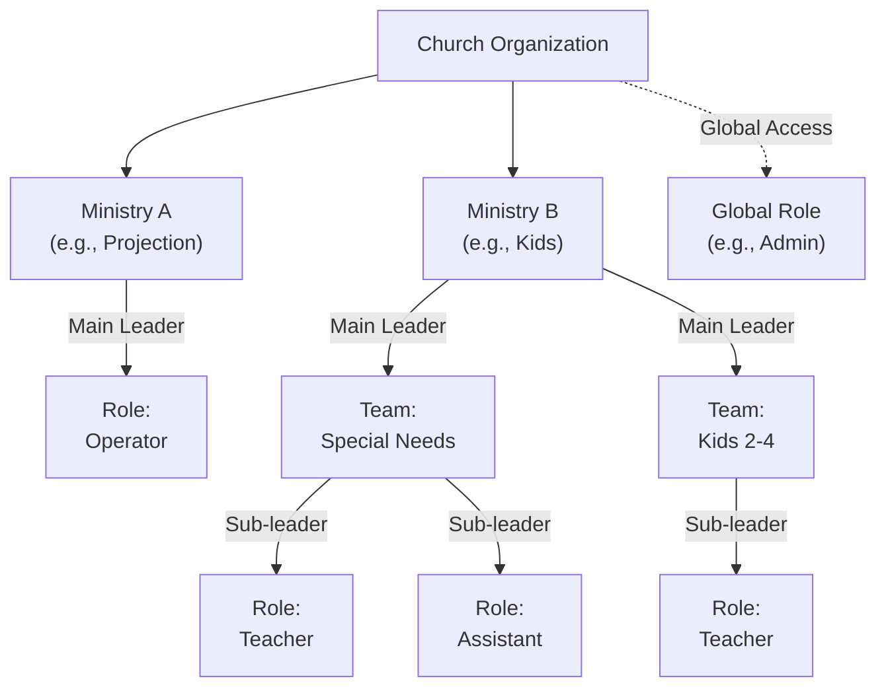
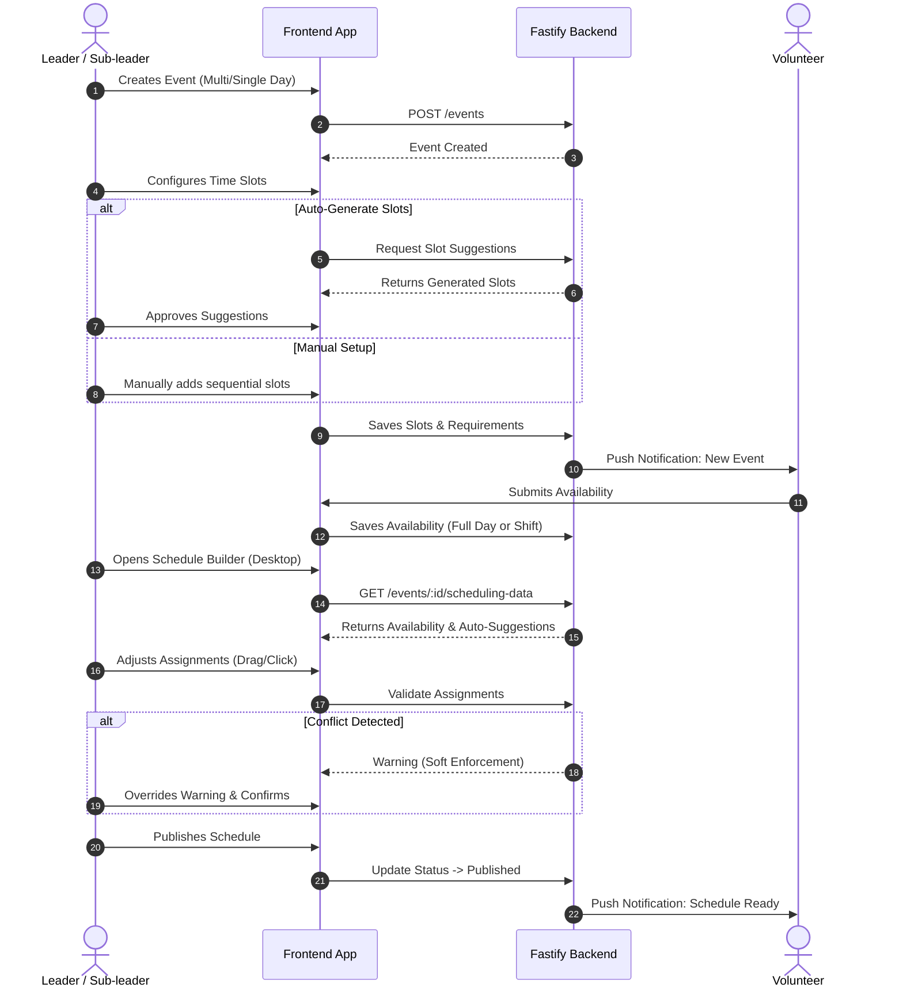
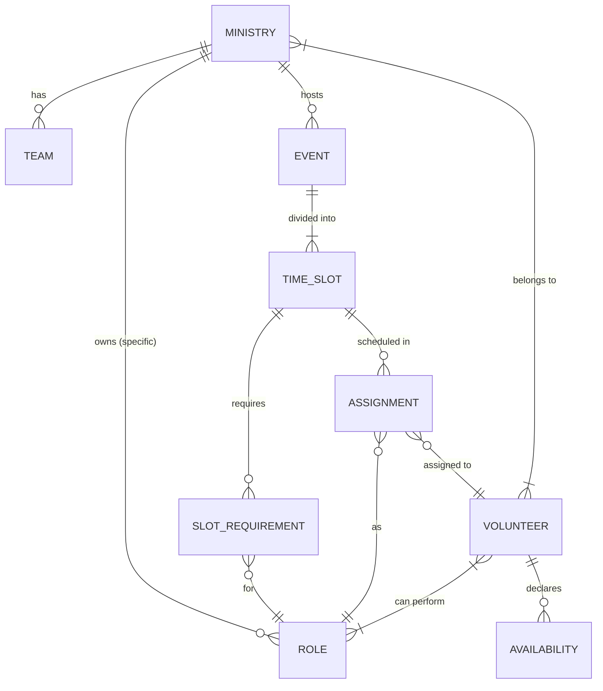

# Architecture & Process Flowcharts

Visual mapping of the Volunteer Scheduling system.

## 1. Ministry Hierarchy & RBAC Structure
This graph shows how ownership and access control flow from the Church level down to specific Teams and Roles.

## 2. Event & Scheduling Process Flow
This sequence diagram breaks down the step-by-step interaction between the Leader, the Frontend UI, the Fastify Backend, and the Volunteer. 
*(Note: Replaced the old "yellow note" that was overflowing with a cleaner `alt` block to handle the Soft Enforcement).*

## 3. Domain Entity-Relationship (ERD)
This diagram maps out the data relationships we defined in `domain-data-model.md`, which will guide our database schema design.

