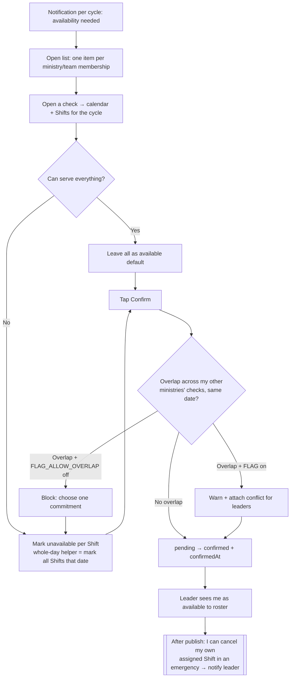

# Availability Check Flow

> **New for Spec 017 (2026-07-02).** How a volunteer answers an `AvailabilityCheck` (one per `(PlanningCycle, MinistryVolunteer membership)`). Available by default; marks are per-`Shift` exceptions; a confirm gate is mandatory. Cross-ministry overlap is governed by a global flag. See [`CONTEXT.md`](../../../CONTEXT.md), [ADR 0002](../../../docs/adr/0002-church-timeslots-ministry-shifts.md).

