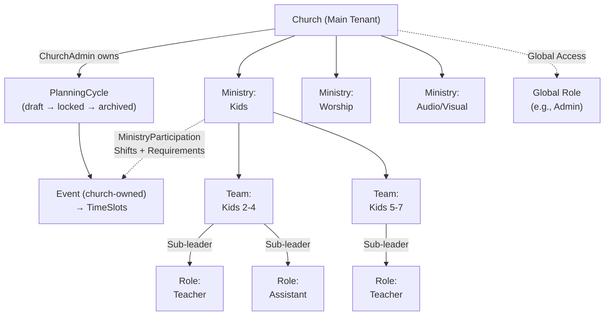

# Church Organizational Structure

> **Refined (017, 2026-07-02):** A **`ChurchAdmin`** role sits above all ministries and owns the church calendar (`PlanningCycle`s, `EventTemplate`s). **Events are church-owned** (under a `PlanningCycle`), not under a ministry; ministries relate to Events through `MinistryParticipation`. The ministry → team → role structure below is unchanged.

