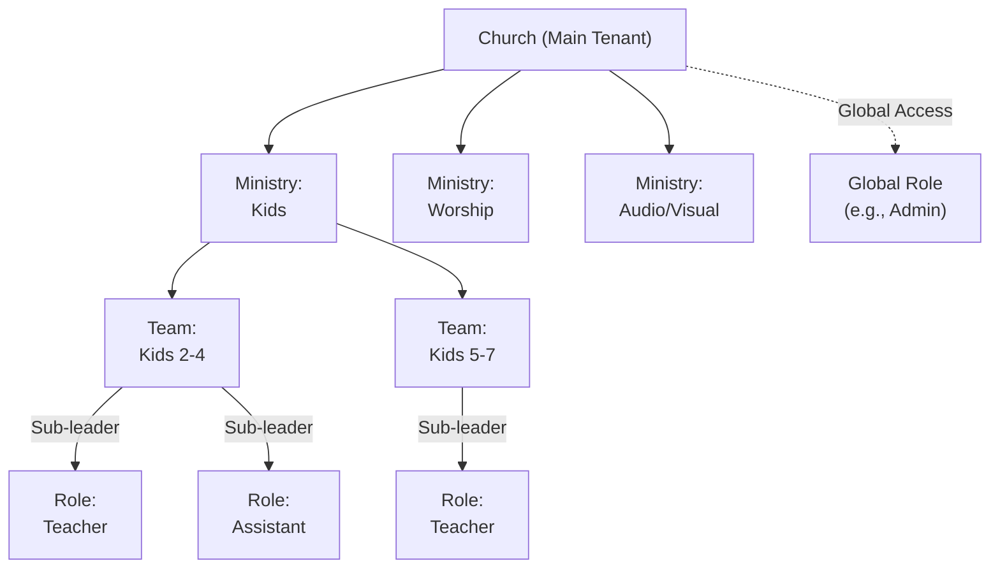

# Church Organizational Structure

```mermaid
graph TD
    CH["Church (Main Tenant)"] --> M1["Ministry:<br>Kids"]
    CH --> M2["Ministry:<br>Worship"]
    CH --> M3["Ministry:<br>Audio/Visual"]
    
    M1 --> T1["Team:<br>Kids 2-4"]
    M1 --> T2["Team:<br>Kids 5-7"]
    
    T1 -->|Sub-leader| R2["Role:<br>Teacher"]
    T1 -->|Sub-leader| R3["Role:<br>Assistant"]
    
    T2 -->|Sub-leader| R4["Role:<br>Teacher"]
    
    %% Global Roles
    CH -.->|Global Access| GR1["Global Role<br>(e.g., Admin)"]
```
