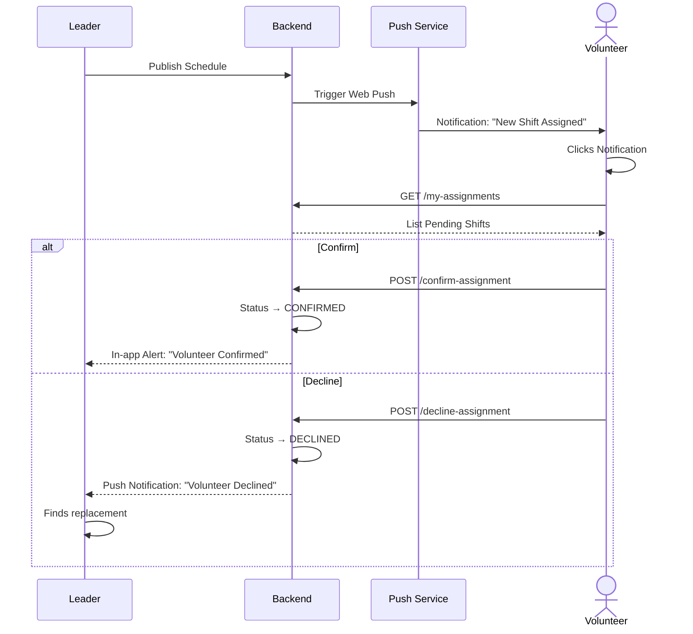

# Assignment Confirmation Flow

```mermaid
sequenceDiagram
    participant L as Leader
    participant API as Backend
    participant P as Push Service
    actor V as Volunteer

    L->>API: Publish Schedule
    API->>P: Trigger Web Push
    P->>V: Notification: "New Shift Assigned"
    V->>V: Clicks Notification
    V->>API: GET /my-assignments
    API-->>V: List Pending Shifts
    
    alt Confirm
        V->>API: POST /confirm-assignment
        API->>API: Status → CONFIRMED
        API-->>L: In-app Alert: "Volunteer Confirmed"
    else Decline
        V->>API: POST /decline-assignment
        API->>API: Status → DECLINED
        API-->>L: Push Notification: "Volunteer Declined"
        L->>L: Finds replacement
    end
```
