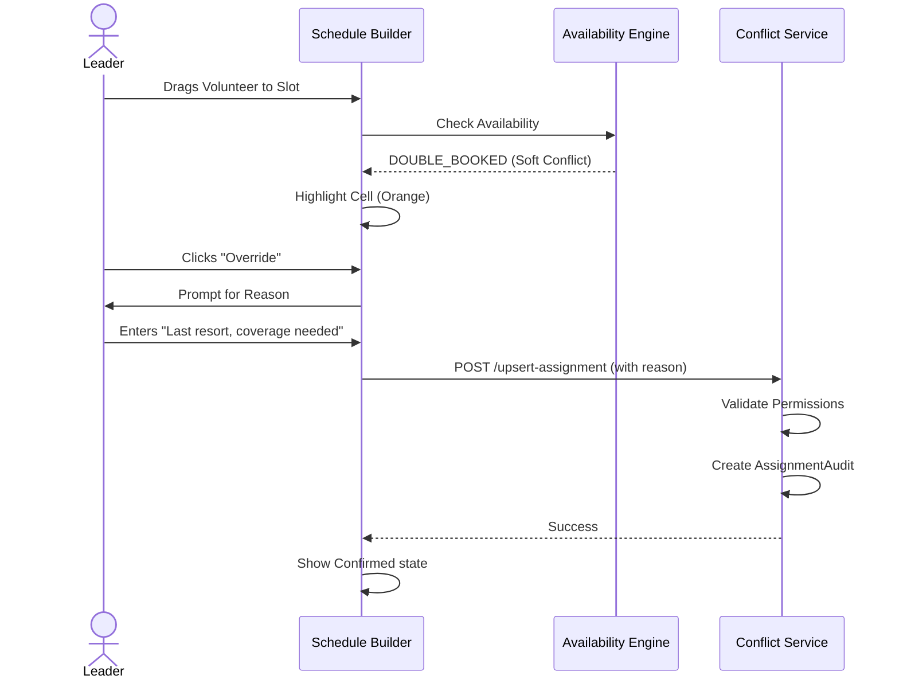

# Conflict Override Flow

```mermaid
sequenceDiagram
    actor L as Leader
    participant UI as Schedule Builder
    participant AE as Availability Engine
    participant CVS as Conflict Service

    L->>UI: Drags Volunteer to Slot
    UI->>AE: Check Availability
    AE-->>UI: DOUBLE_BOOKED (Soft Conflict)
    UI->>UI: Highlight Cell (Orange)
    
    L->>UI: Clicks "Override"
    UI->>L: Prompt for Reason
    L->>UI: Enters "Last resort, coverage needed"
    
    UI->>CVS: POST /upsert-assignment (with reason)
    CVS->>CVS: Validate Permissions
    CVS->>CVS: Create AssignmentAudit
    CVS-->>UI: Success
    UI->>UI: Show Confirmed state
```
