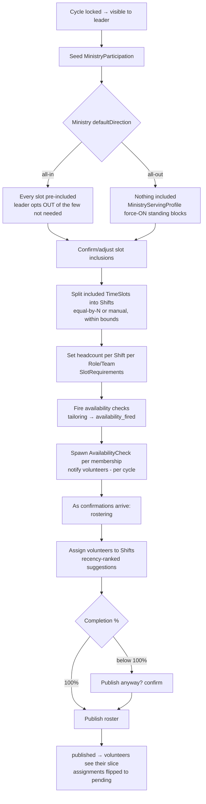

# Ministry Tailoring & Participation Flow

> **New for Spec 017 (2026-07-02).** After a cycle is locked, each ministry leader tailors their `MinistryParticipation` and fires availability. State machine: `tailoring → availability_fired → rostering → published`. See [`CONTEXT.md`](../../../CONTEXT.md), [ADR 0001](../../../docs/adr/0001-church-owned-events-and-planning-cycles.md), [ADR 0002](../../../docs/adr/0002-church-timeslots-ministry-shifts.md).

## Open question for a future assignment-screen feature: "claimed elsewhere" vs. self-reported unavailable

Spec 022 (tailoring workspace) surfaced FR-019 — distinguishing "volunteer self-reported unavailable" from "unavailable because another ministry already claimed them for an overlapping `Shift`" — while building the assignment-suggestion UI's future successor. This distinction **does not exist in the domain today**: `Availability` (hanging off `AvailabilityCheck`) only records the volunteer's own mark, with no field for *why* a shift reads as unavailable.

**Recommendation**: derive "claimed elsewhere" at query time — join the volunteer's `Assignment` rows across other `MinistryParticipation`s for overlapping `Shift` times — rather than persisting a stored `unavailability_reason` column. A stored flag would go stale the moment another ministry's assignment changes; a derived join stays correct by construction. See `specs/022-tailoring-workspace/research.md` R6 and `data-model.md` §10 for the full reasoning. No schema change ships with Spec 022 — this is a note for whoever builds the assignment screen next, so the question starts here instead of being rediscovered.
