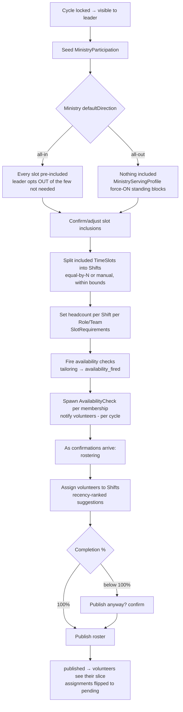

# Ministry Tailoring & Participation Flow

> **New for Spec 017 (2026-07-02).** After a cycle is locked, each ministry leader tailors their `MinistryParticipation` and fires availability. State machine: `tailoring → availability_fired → rostering → published`. See [`CONTEXT.md`](../../../CONTEXT.md), [ADR 0001](../../../docs/adr/0001-church-owned-events-and-planning-cycles.md), [ADR 0002](../../../docs/adr/0002-church-timeslots-ministry-shifts.md).

