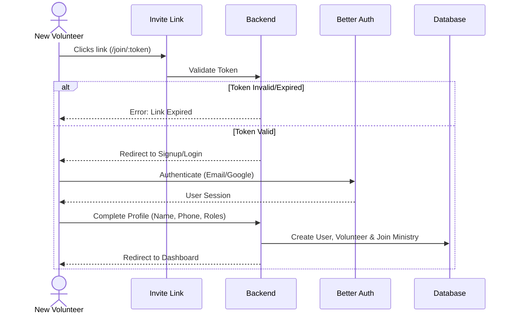

# Onboarding & Invitation Flow

```mermaid
sequenceDiagram
    actor V as New Volunteer
    participant L as Invite Link
    participant API as Backend
    participant Auth as Better Auth
    participant DB as Database

    V->>L: Clicks link (/join/:token)
    L->>API: Validate Token
    alt Token Invalid/Expired
        API-->>V: Error: Link Expired
    else Token Valid
        API-->>V: Redirect to Signup/Login
        V->>Auth: Authenticate (Email/Google)
        Auth-->>V: User Session
        V->>API: Complete Profile (Name, Phone, Roles)
        API->>DB: Create User, Volunteer & Join Ministry
        API-->>V: Redirect to Dashboard
    end
```
