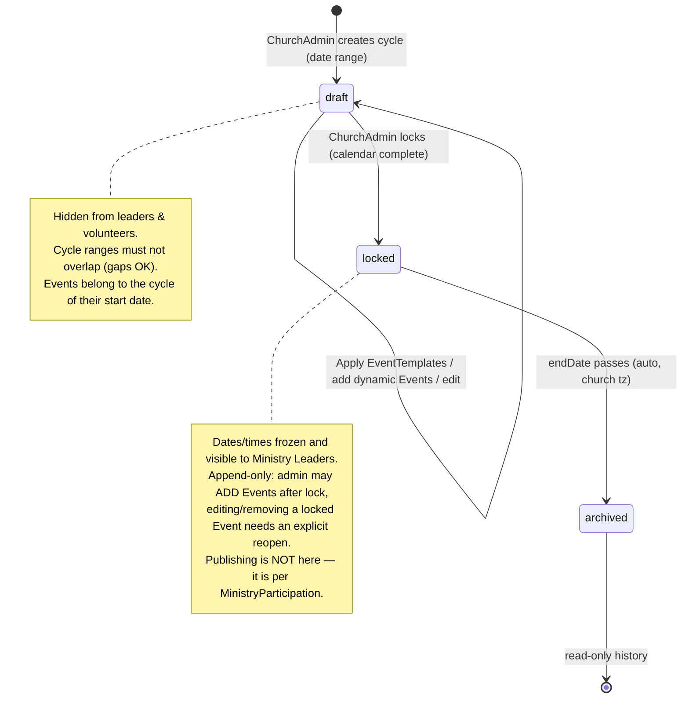

# Planning Cycle Lifecycle

> **New for Spec 017 (2026-07-02).** The `PlanningCycle` is the church-scoped planning window (arbitrary non-overlapping date range, dates-only in church tz). Owned by the `ChurchAdmin`. See [`CONTEXT.md`](../../../CONTEXT.md), [ADR 0001](../../../docs/adr/0001-church-owned-events-and-planning-cycles.md).

