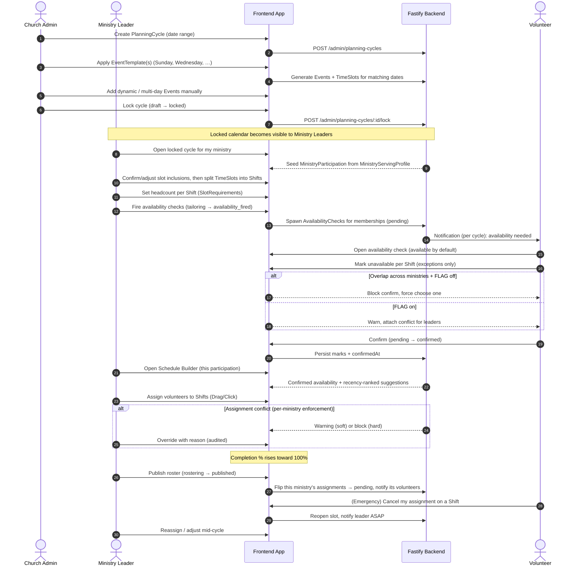

# Scheduling Process Flow

> **Reshaped for Spec 017 (2026-07-02).** The end-to-end flow now runs church → cycle → ministry → volunteer. See [`CONTEXT.md`](../../../CONTEXT.md), [ADR 0001](../../../docs/adr/0001-church-owned-events-and-planning-cycles.md), [ADR 0002](../../../docs/adr/0002-church-timeslots-ministry-shifts.md), [refinement-02](../refinement-02-scheduling-reshape.md). The pre-017 single-event, ministry-owned flow is retired.

