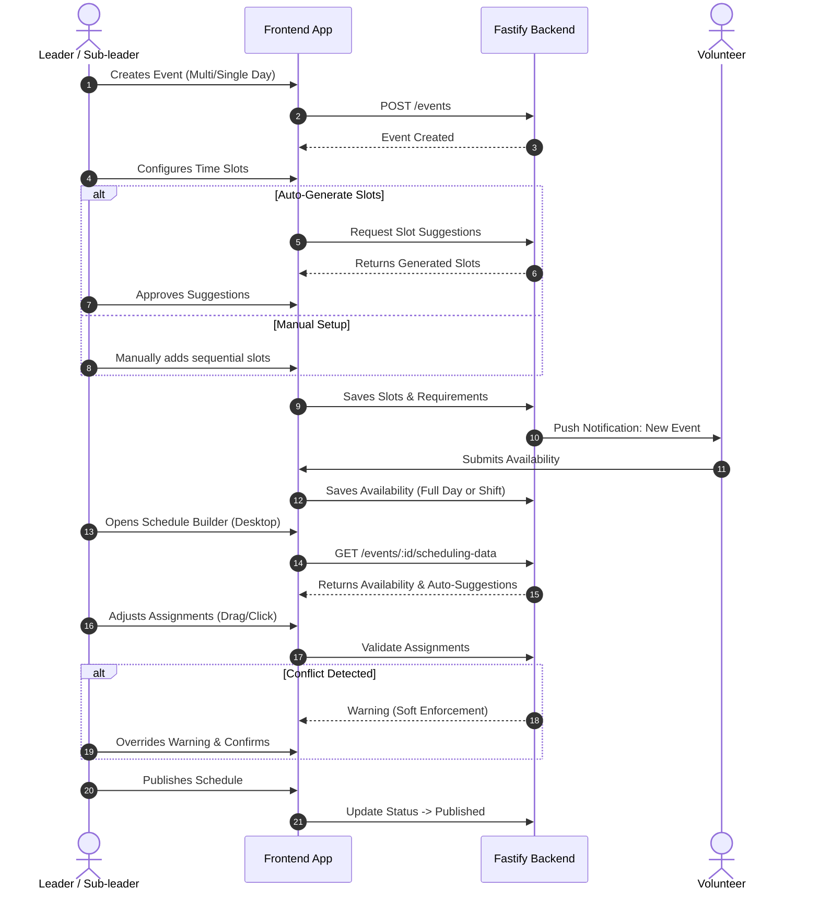

# Scheduling Process Flow

```mermaid
sequenceDiagram
    autonumber
    actor L as Leader / Sub-leader
    participant UI as Frontend App
    participant API as Fastify Backend
    actor V as Volunteer

    %% Event Creation Phase
    L->>UI: Creates Event (Multi/Single Day)
    UI->>API: POST /events
    API-->>UI: Event Created
    
    L->>UI: Configures Time Slots
    alt Auto-Generate Slots
        UI->>API: Request Slot Suggestions
        API-->>UI: Returns Generated Slots
        L->>UI: Approves Suggestions
    else Manual Setup
        L->>UI: Manually adds sequential slots
    end
    UI->>API: Saves Slots & Requirements
    
    %% Volunteer Phase
    API->>V: Push Notification: New Event
    V->>UI: Submits Availability
    UI->>API: Saves Availability (Full Day or Shift)
    
    %% Scheduling Phase
    L->>UI: Opens Schedule Builder (Desktop)
    UI->>API: GET /events/:id/scheduling-data
    API-->>UI: Returns Availability & Auto-Suggestions
    L->>UI: Adjusts Assignments (Drag/Click)
    
    UI->>API: Validate Assignments
    alt Conflict Detected
        API-->>UI: Warning (Soft Enforcement)
        L->>UI: Overrides Warning & Confirms
    end
    
    L->>UI: Publishes Schedule
    UI->>API: Update Status -> Published
```
