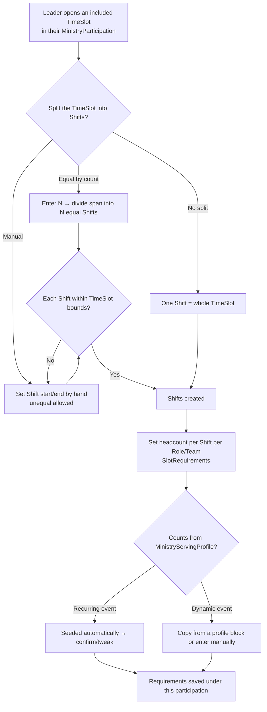

# Shift Generation Flow

> **Reshaped for Spec 017 (2026-07-02).** "Slot generation" split in two: (1) church-level **Event/TimeSlot** generation from `EventTemplate`s — see [template-generation-flow.md](./template-generation-flow.md); (2) per-ministry **`Shift`** creation inside a `MinistryParticipation`, shown here. `RoleTemplate` is removed; per-Shift counts seed from the `MinistryServingProfile` or are set manually. See [ADR 0002](../../../docs/adr/0002-church-timeslots-ministry-shifts.md).

