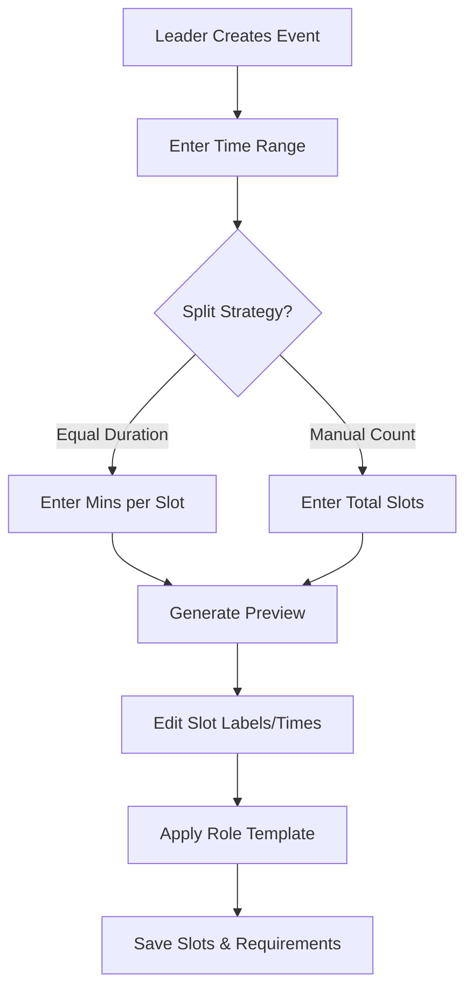

# Slot Generation Flow

```mermaid
graph TD
    A[Leader Creates Event] --> B[Enter Time Range]
    B --> C{Split Strategy?}
    C -->|Equal Duration| D[Enter Mins per Slot]
    C -->|Manual Count| E[Enter Total Slots]
    
    D --> F[Generate Preview]
    E --> F
    
    F --> G[Edit Slot Labels/Times]
    G --> H[Apply Role Template]
    H --> I[Save Slots & Requirements]
```
