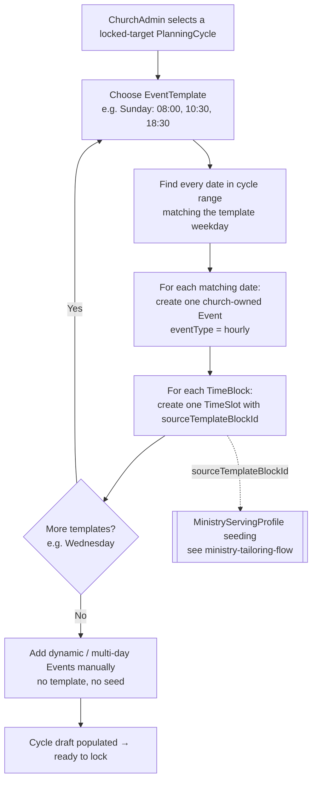

# Event Template Generation Flow

> **New for Spec 017 (2026-07-02).** How a ChurchAdmin's `EventTemplate` (weekday + ordered `TimeBlock`s) materialises a cycle's recurring Events. Each generated `TimeSlot` records `sourceTemplateBlockId`, which is the hinge a `MinistryServingProfile` matches on to auto-seed inclusions. See [`CONTEXT.md`](../../../CONTEXT.md), [ADR 0001](../../../docs/adr/0001-church-owned-events-and-planning-cycles.md).

