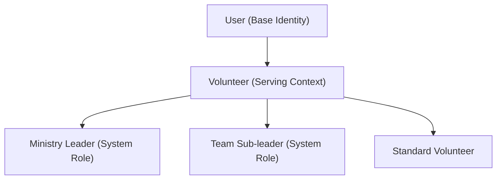

# Spec 01: Core Entities — User, Church, Ministry & Volunteer

## Purpose
Define the foundational entities for the organizational structure. All entities must be tied to a `Church` to support multi-tenancy.

---

## 1. User Entity (Foundation)
The base identity for all actors. This entity is managed by the authentication system (Better Auth).

### Fields
- **id**: UUID (Primary Key)
- **email**: String (Unique)
- **name**: String
- **image**: String (Profile picture)
- **created_at / updated_at**: Timestamps

---

## 2. Church Entity
The top-level organization.

### Fields
- **id**: UUID (Primary Key)
- **name**: String (e.g., "Abundant Life Church")
- **slug**: String (Unique, for subdomains/paths)
- **settings**: JSONB (Global settings)
- **created_at / updated_at**: Timestamps

---

## 3. Ministry Entity
A functional department within a church.

### Fields
- **id**: UUID (Primary Key)
- **church_id**: UUID (Foreign Key to Church)
- **name**: String (e.g., "Projection", "Worship")
- **description**: Text (Optional)
- **settings**: JSONB
    - `enforcement_type`: "soft" | "hard" (default: "soft")
- **created_at / updated_at**: Timestamps

---

## 4. Team Entity
A sub-group within a Ministry.

### Fields
- **id**: UUID (Primary Key)
- **church_id**: UUID (Foreign Key to Church)
- **ministry_id**: UUID (Foreign Key to Ministry)
- **name**: String
- **leader_id**: UUID (Foreign Key to Volunteer - optional sub-leader)

---

## 5. Volunteer Entity (Serving Context)
A volunteer is a `User` who serves in one or more ministries. 
**Important**: All Leaders (Team or Ministry) are first registered as Volunteers.

### Entity Hierarchy Diagram

### Fields (Volunteer)
- **id**: UUID (Primary Key - Foreign Key to `User.id`)
- **church_id**: UUID (Foreign Key to Church)
- **status**: "active" | "inactive" | "on_hold"
- **notes**: Text (Private global notes)

### Fields (Ministry_Volunteer Join Table)
- **id**: UUID (Primary Key)
- **church_id**: UUID (Foreign Key to Church)
- **volunteer_id**: UUID (Foreign Key to Volunteer)
- **ministry_id**: UUID (Foreign Key to Ministry)
- **team_id**: UUID (Optional - Foreign Key to Team)
- **system_role**: "LEADER" | "SUB_LEADER" | "VOLUNTEER" (Default: "VOLUNTEER")
- **status**: "active" | "inactive"
- **joined_at**: Timestamp

---

## 6. Role Entity
Functions that volunteers can perform.

### Fields
- **id**: UUID (Primary Key)
- **church_id**: UUID (Foreign Key to Church)
- **name**: String (e.g., "Camera Operator")
- **is_global**: Boolean (If true, available to all ministries in the church)
- **ministry_id**: UUID (Optional - Foreign Key if not global)

---

## 7. Testing Requirements (Mandatory)
- **Unit**: Verify that a `Ministry` cannot be created without a `church_id`.
- **Unit**: Verify that `system_role` defaults to `VOLUNTEER`.
- **Integration**: Verify that a `Volunteer` can be associated with multiple `Ministries` via the join table.
- **Security**: Ensure that `Team` resources are only accessible if the user belongs to the same `church_id`.
